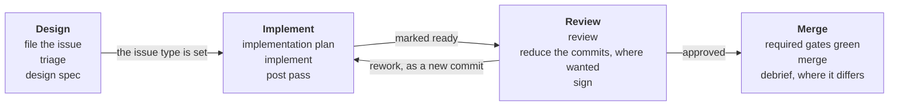

# A change is specified before it is built

## Context and Problem Statement

purba follows a sequence of steps, and no file states it.
The sequence was decided on an issue that closed with no pull request, so its answer lives in one comment.

The answer itself drifted.
Later decisions removed some of its gates and changed another, and the comment still reads as current.

## Considered Options

- **Specify first, in phases that each leave an artifact for a reader.** Chosen. No alternative was put forward.

## Decision Outcome

**Reach:** [issue](../../CONTEXT.md#issue) [design spec](../../CONTEXT.md#design-spec) [pull request](../../CONTEXT.md#pull-request) [implementation plan](../../CONTEXT.md#implementation-plan) [post pass](../../CONTEXT.md#post-pass) [debrief](../../CONTEXT.md#debrief) `/AGENTS.md` `/CONTRIBUTING.md` `/.config/tasks.toml` `.github/PULL_REQUEST_TEMPLATE.md`

A change is specified before it is built, and it moves through four phases that each leave one artifact for one reader.

| phase | leaves | for |
|---|---|---|
| Design | a [design spec](../../CONTEXT.md#design-spec) | the [coder](../../CONTEXT.md#coder) |
| Implement | a [pull request](../../CONTEXT.md#pull-request) | the [reviewer](../../CONTEXT.md#reviewer) |
| Review | an approval | purba, which derives the [acceptance](../../CONTEXT.md#acceptance) from it |
| Merge | commits on `main` | every later reader |

**No spec, no implementation.**
An issue is specified when its type is set.
[An artifact is rewritten until its direction is agreed](an-artifact-is-rewritten-until-its-direction-is-agreed.md) makes the type the declaration, and this record relies on it.
The type is set once the person who decides agrees to the spec, and never before.
An agent may then set it for that person.
[purba records delegation and does not prevent it](purba-records-delegation-and-does-not-prevent-it.md).

**Two changes owe no design spec.**

- A pull request that a machine opens.
- A [repair](../../CONTEXT.md#repair).

Both still name an issue.
Whether a change is a repair is a judgement, and the reviewer makes it.

**A question is not exempt.**
The answer to a question is posted on its issue as the design spec, and the record is its implementation.

**A rule somebody acts on lands in a tracked file before its issue closes.**
Research, a refusal and a decision to build no gate may close on the tracker.

**An issue is filed at any point.**
A defect found in the implementation is filed then, and never waits for a design.
[Triage](../../CONTEXT.md#triage) follows the filing.

**The time a spec is written is not fixed.**
A milestone design may specify every issue it holds.
The spec is read against the tree when the issue is taken up, and narrowed where the tree moved.

**An [implementation plan](../../CONTEXT.md#implementation-plan) is owed before the implementation.**
It shows the reviewer how the author meant to build the change.
It need not name the commits.
[A register belongs to one location](a-register-belongs-to-one-location.md) names the register that says where the plan is written.

**The [post pass](../../CONTEXT.md#post-pass) is owed on work an agent wrote.**

**A pull request opens as a draft.**
Marked ready, it asks for the reviewer.
[The agent that marks a pull request ready watches it](the-agent-that-marks-a-pull-request-ready-watches-it.md).

**An open pull request keeps its history.**
A change made in review is a new commit, so the reviewer sees what moved since the last round.
The branch is rewritten only to follow `main`.
Once the reviewer is satisfied, the commits may be reduced to the ones [a commit message outlives its review](a-commit-outlives-its-review.md) asks for.
The person then signs the branch, and [`CONTRIBUTING.md`](../../CONTRIBUTING.md) says how.
No sign-off is owed before that.

[One pull request answers one issue](one-pull-request-answers-one-issue.md).

**A [debrief](../../CONTEXT.md#debrief) is owed when the merged change differs from its implementation plan.**

**A [gate](../../CONTEXT.md#gate) runs at any point before the review.**
`.config/tasks.toml` names the ones a contributor runs, and `CONTRIBUTING.md` names what refuses a merge.

**Downside:**

- **Nothing refuses any of it.** Every step is a convention, and only the reviewer notices one that was skipped.
- **The repair exemption is a judgement.** A change that carries a decision can be called a repair, and it then merges with no spec.
- **The type protects little yet.** Few issues carry one, so the sign that an issue is specified is new in practice.
- **An agent can set the type with no agreement behind it.** Nothing tells the two acts apart afterwards.
- **A spec written early goes stale.** The read against the tree is all that catches it, and nothing prompts that read.
- **`Origin` reads red through the whole review.** The branch stays unsigned until the reviewer is satisfied, so that check says nothing before then.
- **The record is rewritten when a step changes.** [A location inherits its readers](a-location-inherits-its-readers.md) refused to key itself to stages for that reason.

## Confirmation

No command decides any of this, and none is planned.
Each step leaves something a reader can look for.

| step | what shows it |
|---|---|
| the issue is specified | `gh issue view <n> --json issueType` |
| the spec came first | a comment on the issue, earlier than the pull request |
| the pull request asks for review | it is not a draft |
| the history was kept | the pull request shows no force push between two review rounds |

[`AGENTS.md`](../../AGENTS.md) carries these steps to an agent before it acts.
